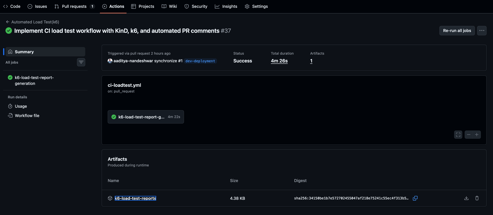
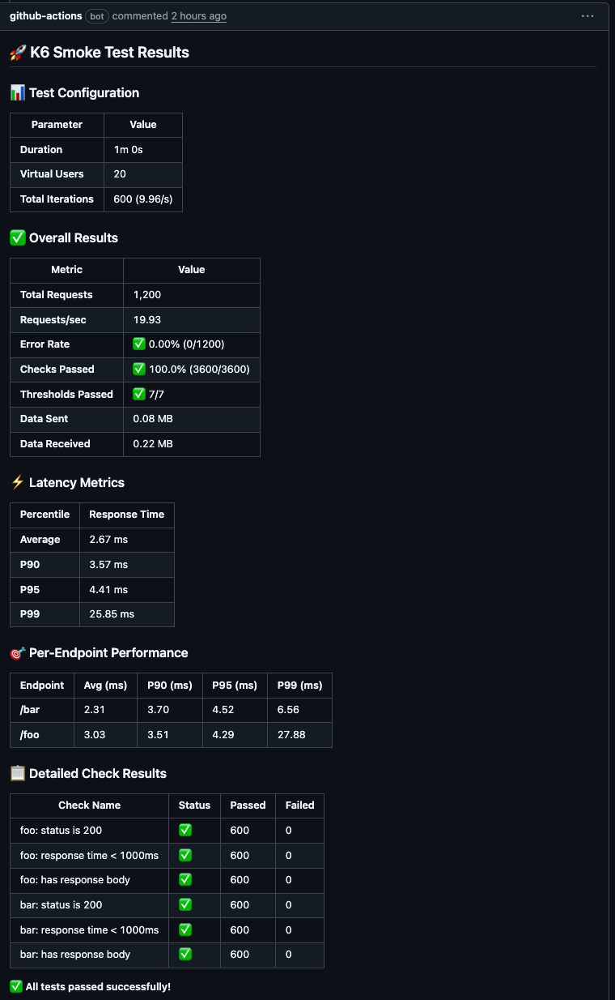
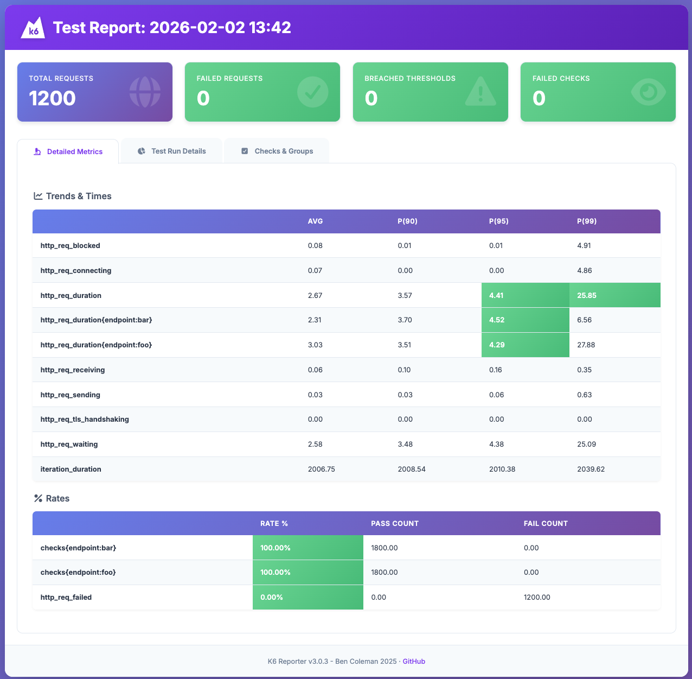
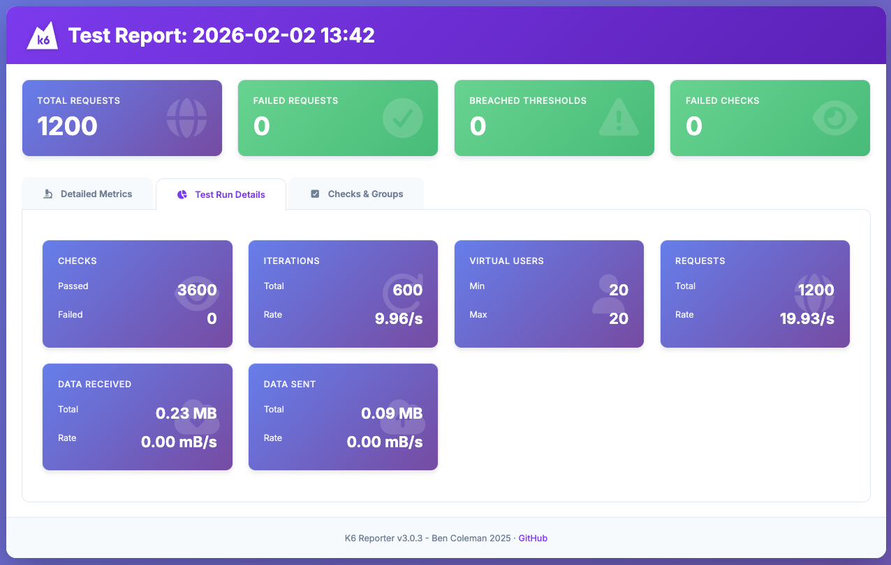
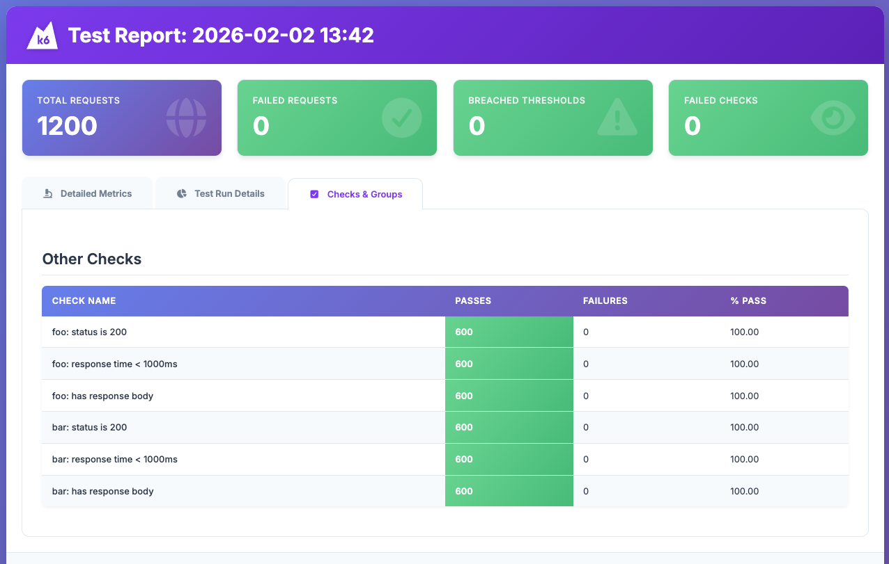

# Automated Load Testing & Report Generation With K6

## Overview

This repository contains a comprehensive GitHub Actions workflow that automatically tests Kubernetes application performance on every pull request. The workflow:

- Provisions a **multi-node KinD Kubernetes cluster** (1 control-plane, 2 workers)
- Deploys an **NGINX ingress controller** with NodePort access
- Deploys two **http-echo** services using **Kustomize overlays**:
  - `foo-echo` responding with `foo`
  - `bar-echo` responding with `bar`
- Configures **path-based ingress routing**:
  - `http://localhost:8080/foo` → `foo-echo` service
  - `http://localhost:8080/bar` → `bar-echo` service
- Runs comprehensive **k6 load tests** (smoke, average load, stress, spike, and soak tests)
- Posts a **detailed PR comment** with formatted test results including latency metrics, error rates, and threshold status

## Repository Structure

```
.
├── .github/
│   └── workflows/
│       └── ci-loadtest.yml          # Main CI workflow
├── k8s/
│   ├── apps/
│   │   ├── base/                    # Base Kustomize resources
│   │   │   ├── deployments/         # Deployment templates
│   │   │   ├── ingress/             # Ingress configuration
│   │   │   └── namespaces/          # Namespace definitions
│   │   └── overlays/
│   │       └── env/
│   │           ├── dev/             # Development environment overlays
│   │           │   ├── ingress/     # Dev ingress customization
│   │           │   └── services/
│   │           │       ├── bar/     # Bar service customization
│   │           │       └── foo/     # Foo service customization
│   │           └── namespace/       # Namespace overlay
│   └── ingress-controller/
│       └── ingress-controller.yaml  # NGINX Ingress Controller manifests
├── kind/
│   └── kind-config.yaml             # KinD cluster configuration
├── load_tests/
│   └── testing_scripts/
│       ├── smoke_test_k6.js         # Quick validation test (20 VUs, 1min)
│       ├── avg_load_test_k6.js      # Normal load test (100 VUs, 9min)
│       ├── stress_test_k6.js        # Beyond capacity test (200 VUs, 5min)
│       ├── spike_test_k6.js         # Sudden traffic spike test (2000 VUs, 5min)
│       └── soak_test_k6.js          # Long-duration stability test (100 VUs, 20min)
├── scripts/
│   ├── setup_kind_cluster.sh        # Creates KinD cluster
│   ├── deploy_ingress.sh            # Deploys NGINX ingress controller
│   ├── deploy_echo_services.sh      # Deploys foo/bar services with Kustomize
│   ├── check_health.sh              # Validates cluster health and routing
│   └── post_pr_comment.py           # Posts k6 results as PR comment
├── ACCESS_ENDPOINTS.md              # Detailed endpoint access guide
├── K6_LOAD_TESTING_SUITE.md         # Comprehensive k6 testing documentation
├── LICENSE
└── README.md
```

## Load Test Suite

This repository includes 5 types of k6 load tests, each serving a specific purpose:

| Test Type | Purpose | Duration | Virtual Users | Use Case |
|-----------|---------|----------|---------------|----------|
| **Smoke Test** | Quick validation | 1 min | 20 | Verify basic functionality before larger tests |
| **Average Load** | Baseline performance | 9 min | 100 | Test under typical traffic conditions |
| **Stress Test** | Find breaking point | 5 min | 200 | Identify maximum capacity and bottlenecks |
| **Spike Test** | Handle sudden traffic | 5 min | 100→2000→100 | Verify auto-scaling and recovery |
| **Soak Test** | Long-term stability | 20 min | 100 | Detect memory leaks and degradation |

For detailed information about each test type, see [K6_LOAD_TESTING_SUITE.md](K6_LOAD_TESTING_SUITE.md).

## Running the Flow Locally

### Prerequisites

- **Docker** (20.10+)
- **kind** (v0.24.0+)
- **kubectl** (v1.30.0+)
- **k6** (latest)
- **Python 3.11+** with `requests` library

### Installation

**Install k6:**
```bash
# macOS
brew install k6

# Linux (Debian/Ubuntu)
sudo gpg -k
sudo gpg --no-default-keyring --keyring /usr/share/keyrings/k6-archive-keyring.gpg \
  --keyserver hkp://keyserver.ubuntu.com:80 --recv-keys C5AD17C747E3415A3642D57D77C6C491D6AC1D69
echo "deb [signed-by=/usr/share/keyrings/k6-archive-keyring.gpg] https://dl.k6.io/deb stable main" | \
  sudo tee /etc/apt/sources.list.d/k6.list
sudo apt-get update
sudo apt-get install k6

# Windows
choco install k6
```

**Install Python dependencies:**
```bash
pip install requests
```

### Local Setup Steps

1. **Set up the KinD cluster:**
   ```bash
   bash scripts/setup_kind_cluster.sh
   ```

2. **Deploy the NGINX ingress controller:**
   ```bash
   bash scripts/deploy_ingress.sh
   ```

3. **Deploy the foo/bar echo services using Kustomize:**
   ```bash
   bash scripts/deploy_echo_services.sh
   ```

4. **Verify health and routing:**
   ```bash
   bash scripts/check_health.sh
   ```

5. **Run a load test:**
   ```bash
   # Smoke test (quick validation)
   k6 run load_tests/testing_scripts/smoke_test_k6.js
   
   # Average load test (baseline performance)
   k6 run load_tests/testing_scripts/avg_load_test_k6.js
   
   # Stress test (find limits)
   k6 run load_tests/testing_scripts/stress_test_k6.js
   
   # Spike test (test elasticity)
   k6 run load_tests/testing_scripts/spike_test_k6.js
   
   # Soak test (long-duration stability)
   k6 run load_tests/testing_scripts/soak_test_k6.js
   ```

6. **Preview the PR comment (requires summary JSON):**
   ```bash
   python scripts/post_pr_comment.py --summary-file smoke-test-summary-*.json
   ```

### Testing Endpoints

After deployment, test the endpoints directly:

```bash
# Test foo endpoint
curl http://localhost:8080/foo
# Expected output: foo

# Test bar endpoint
curl http://localhost:8080/bar
# Expected output: bar

# Test with verbose output
curl -v http://localhost:8080/foo
curl -v http://localhost:8080/bar
```

For more details on accessing endpoints, see [ACCESS_ENDPOINTS.md](ACCESS_ENDPOINTS.md).

## Download HTML Report From Summary -> Artifacts

Once the `Run somke test with k6` step completed, it will generate the k6 summary report in HTML & JSON format. And only HTML report file will be uploaded into the artifacts github action summary in next step.

<p align="center">

<br/>
<em>Download K6 HTML Report From Artifacts</em>
</p>


## Sample PR Comment

When the `Upload all load test reports to artifacts` is successful, in the next stage PR comment is generated by processing the k6 summary JSON report file, it automatically posts a detailed comment with the load test results.

Check all load test results here - 
[Commit History](https://github.com/aaditya-nandeshwar/CI-Load-Test/pull/1)

<p align="center">

<br/>
<em>PR Comment</em>
</p>

## Sample Smoke Test HTML Report

<p align="center">

<br/>
<em>Smoke Test Report - 1st Page</em>
</p>

<p align="center">

<br/>
<em>Smoke Test Report - 2nd Page</em>
</p>

<p align="center">

<br/>
<em>Smoke Test Report - 3rd Page</em>
</p>


This provides reviewers with immediate insight into:
- **Performance**: Latency percentiles (P90, P95, P99)
- **Reliability**: Error rates and check pass rates
- **Capacity**: Requests per second and throughput
- **Quality**: Per-endpoint breakdown and threshold status

## Architecture

The CI workflow follows this sequence:

```
1. Cluster Provisioning
   └─> Creates multi-node KinD cluster with port mappings

2. Ingress Deployment
   └─> Deploys NGINX Ingress Controller as NodePort (8080)

3. Application Deployment
   └─> Uses Kustomize to deploy foo-echo and bar-echo services
       └─> Base resources + environment-specific overlays

4. Health Verification
   └─> Validates pods, services, and ingress routing

5. Load Testing
   └─> Runs k6 test suite (smoke, load, stress, spike, or soak)
       └─> Generates timestamped JSON summary

6. Results Posting
   └─> Formats and posts test results as PR comment via GitHub API
```

## Configuration

### Environment Variables

All k6 tests support these environment variables:

```bash
# Custom target URL
k6 run -e TARGET_URL=https://api.example.com load_tests/testing_scripts/smoke_test_k6.js

# Custom think time (seconds between requests)
k6 run -e THINK_TIME=2 load_tests/testing_scripts/avg_load_test_k6.js

# Combined
k6 run -e TARGET_URL=http://localhost:8080 -e THINK_TIME=0.5 load_tests/testing_scripts/stress_test_k6.js
```

### Kustomize Overlays

The application deployment uses Kustomize overlays for environment-specific configuration:

- **Base**: Common resources (deployments, services, ingress)
- **Overlays**: Environment-specific customizations
  - `dev/services/foo`: Foo service configuration
  - `dev/services/bar`: Bar service configuration
  - `dev/ingress`: Ingress routing rules

To customize deployments:
```bash
# Edit base resources
vi k8s/apps/base/deployments/deployment.yaml

# Edit environment-specific overlays
vi k8s/apps/overlays/env/dev/services/foo/kustomization.yaml

# Apply changes
kubectl apply -k k8s/apps/overlays/env/dev/services/foo
```

### Ingress Port

The ingress controller uses NodePort 8080. To change this:

1. Update `k8s/ingress-controller/ingress-controller.yaml` (NodePort value)
2. Update `kind/kind-config.yaml` (port mapping in extraPortMappings)
3. Update `scripts/check_health.sh` (INGRESS_PORT variable)
4. Update all k6 test scripts (BASE_URL default value)

### Load Test Thresholds

Each k6 test has specific thresholds. To adjust:

```javascript
// Example: Edit smoke_test_k6.js
export const options = {
  thresholds: {
    'http_req_duration': ['p(95)<1000', 'p(99)<2000'],  // Adjust these values
    'http_req_failed': ['rate<0.01'],  // Adjust failure rate threshold
  },
};
```

## GitHub Actions Workflow

The workflow is triggered on:
- Pull requests to the default branch
- Manual workflow dispatch

Key workflow steps:
1. Checkout code
2. Set up KinD cluster
3. Deploy ingress controller
4. Deploy applications with Kustomize
5. Verify health
6. Run k6 load test
7. Post PR comment with results

To customize the workflow:
```yaml
# .github/workflows/ci-loadtest.yml
env:
  TEST_TYPE: "smoke"  # Change to: smoke, avg_load, stress, spike, soak
```

## Troubleshooting

### Cluster Setup Issues

```bash
# Check cluster status
kind get clusters
kubectl cluster-info --context kind-ci-loadtest

# View cluster nodes
kubectl get nodes

# Check node status
kubectl describe node ci-loadtest-control-plane
```

### Ingress Not Accessible

```bash
# Check ingress controller service
kubectl get svc -n ingress-nginx ingress-nginx-controller

# Check ingress resource
kubectl get ingress -A
kubectl describe ingress echo-ingress -n default

# View ingress controller logs
kubectl logs -n ingress-nginx deployment/ingress-nginx-controller --tail=100

# Check if NodePort is listening
netstat -tuln | grep 8080
```

### Application Deployment Issues

```bash
# Check Kustomize build output
kubectl kustomize k8s/apps/overlays/env/dev/services/foo
kubectl kustomize k8s/apps/overlays/env/dev/services/bar

# Check deployments
kubectl get deployments -A
kubectl describe deployment foo-echo -n default
kubectl describe deployment bar-echo -n default

# Check pods
kubectl get pods -A
kubectl logs -l app=foo-echo
kubectl logs -l app=bar-echo
```

### Load Test Failures

```bash
# Run k6 with verbose output
k6 run --verbose load_tests/testing_scripts/smoke_test_k6.js

# Check if endpoints are accessible
curl -v http://localhost:8080/foo
curl -v http://localhost:8080/bar

# Test from within the cluster
kubectl run -it --rm debug --image=curlimages/curl --restart=Never -- \
  curl -v http://foo-echo.default.svc.cluster.local/foo
```

### PR Comment Not Posted

```bash
# Check GitHub token permissions (requires: issues: write, pull-requests: write)
# Verify GITHUB_TOKEN is set in workflow

# Test PR comment script locally (requires GitHub event context)
export GITHUB_TOKEN=your_token
export GITHUB_EVENT_PATH=/path/to/event.json
python scripts/post_pr_comment.py --summary-file test-summary.json
```

For more detailed troubleshooting guides:
- Endpoint access issues: [ACCESS_ENDPOINTS.md](ACCESS_ENDPOINTS.md)
- k6 test configuration: [K6_LOAD_TESTING_SUITE.md](K6_LOAD_TESTING_SUITE.md)

## Performance Benchmarks

Expected performance on GitHub Actions runners (Standard 2-core):

| Test Type | Duration | Total Requests | Avg Latency | P95 Latency | Error Rate |
|-----------|----------|----------------|-------------|-------------|------------|
| Smoke | 1 min | ~1,200 | ~10ms | ~20ms | <1% |
| Avg Load | 9 min | ~42,060 | ~15ms | ~30ms | <5% |
| Stress | 5 min | ~48,000 | ~20ms | ~50ms | <5% |
| Spike | 5 min | ~250,000 | ~50ms | ~150ms | <10% |
| Soak | 20 min | ~104,900 | ~15ms | ~35ms | <5% |

*Note: Actual results vary based on runner resources and network conditions.*

## Contributing

Contributions are welcome! Please:

1. Fork the repository
2. Create a feature branch
3. Make your changes
4. Run the full test suite locally
5. Submit a pull request

All PRs will automatically run the CI load test workflow.

## License

This project is licensed under the terms specified in the [LICENSE](LICENSE) file.

## Additional Resources

- [k6 Documentation](https://k6.io/docs/)
- [KinD Documentation](https://kind.sigs.k8s.io/)
- [NGINX Ingress Controller](https://kubernetes.github.io/ingress-nginx/)
- [Kustomize Documentation](https://kustomize.io/)

---

**Questions or Issues?** Please open an issue in this repository.